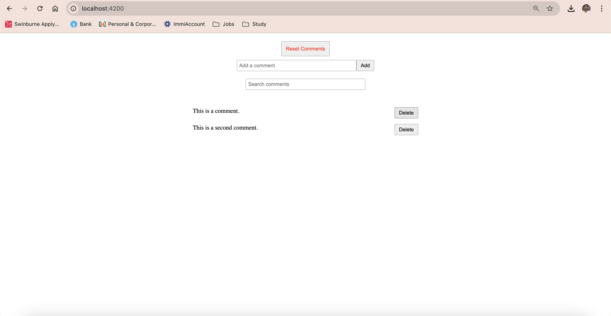

I developed a comment feed feature in an Angular application with enhanced search functionality. I utilized RxJS to manage user input efficiently:  Debouncing: Applied debounceTime(300) to limit API calls, ensuring requests are only made after 300 milliseconds of user inactivity. SwitchMap: Used switchMap to cancel previous search requests, processing only the most recent query to keep the results relevant and up-to-date. Error Handling: Implemented catchError to handle and log errors gracefully, returning an empty array if an error occurs to maintain application stability. The final implementation effectively updates the comment feed based on search input, providing a smooth and responsive user experience.

Install [node/npm](https://nodejs.org/en/)

`npm install` to get started.

`npm start` to start the dev server and the JSON server. This will start the dev server on port 4200, and you can see your application in a browser at `http://localhost:4200`.

We are using [json-server](https://github.com/typicode/json-server) to mock a backend for this task. When running locally, the json-server will run at `http://localhost:3001`.

The following API endpoints are available:

* `/api/comments/` (**GET**) - Get all comments

  * Response code: `200 OK`

  * Response format:

    ```json
    [
        {
            "id": 1,
            "text": "This is a comment."
        },
        {
            "id": 2,
            "text": "This is a second comment."
        },
        ...
    ]
    ```

* `/api/comments/<id>` (**GET**) - Gets a single comment

  * Response code: `200 OK`

  * Response format:

    ```json
    {
        "id": 1,
        "text": "This is a comment."
    }
    ```

* `/api/comments/` (**POST**) - Add a comment

  * Response code: `201 Created`

  * Response format:

    ```json
    {
        "id": 3,
        "text": "Another comment"
    }
    ```

* `/api/comments/<id>` (**DELETE**) - Delete comment with the given id

  * Response code: `200 OK`

  * Response format:

    ```
    {}
    ```
* `/api/reset-comments/` (**POST**) - Reset the database to the initial state

  * Response code: `204 No Content`
  * Response format: **No data**

* `/api/comments?q=<string>` (**GET**) - searches for the comments with given string

  * Response code: `200 OK`

  * Response format:

    ```
    [{
        "id": 3,
        "text": "searched comment"
    }]
    ```

## SCREENSHOT

